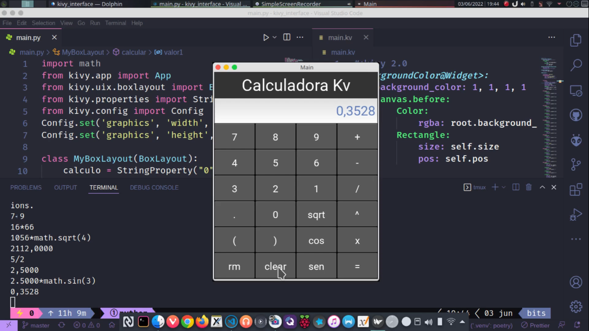

# Projeto de uma Calculadora com Python

### Interface Gráfica com Python usando Kivy.

Este projeto consiste na criação de uma calculadora utilizando Python, com o suporte das bibliotecas Kivy e NumPy. A calculadora oferece as seguintes funcionalidades:

1. Operações básicas: soma, subtração, multiplicação e divisão
2. Cálculo de raiz quadrada
3. Cálculo de seno e cosseno
4. Função para limpar a tela


As bibliotecas Kivy e NumPy são utilizadas para criar uma interface gráfica interativa e para realizar cálculos matemáticos complexos de forma eficiente, respectivamente.




Use uma env exclusiva para o projeto, para isso você precisa ter o pip, python3 e (virtualenv ou poetry ou pyenv) instalado em sua máquina, tendos, faça:

**Usando Virtualenv No Linux**
```
virtualenv .venv
source .venv/bin/activate
pip install kivy
```

**Usando Virtualenv No Windows**
```
virtualenv .venv
.venv/Scripts/Activate
pip install kivy
```

**Usando o Poetry**
```
poetry shell
poetry add kivy
```

